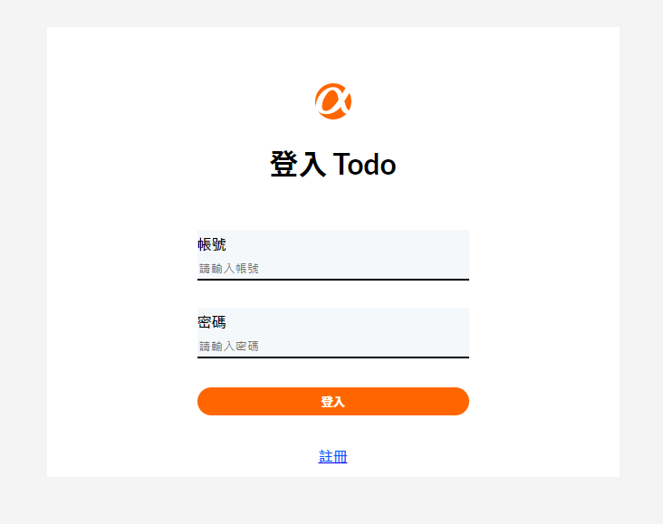

# Todo List - React
- Todo List : [Demo](https://timwang95.github.io/todolist-react/login)



# ⚙️Features 
使用者可以使用測試帳號登入：
```
帳號：abc999
密碼：abc999
```
- Login / Logout
- Add TodoItem
- Edit TodoItem
- Delete TodoItem

# 💻 Built with
- React
- Node.js
- Axios
- Styled-conponents
- Sweetalert2

# 🚀 Getting start 
1. 請先確認有安裝 Node.js 與 npm

2. 將專案 clone 到本地，在終端機輸入：
```
  $ git clone "https://github.com/TimWang95/todolist-react.git"
```

3. 在本地開啟之後，透過終端機進入資料夾，輸入：
```
  $ npm install
```

4. 安裝完畢後，繼續輸入：
```
  $ npm start
```

5. 若在最末行看見此訊息則代表順利運行，且瀏覽器會自動進入到該網址：http://localhost:3000

6. 若欲暫停使用，請按下：`ctrl + c`
