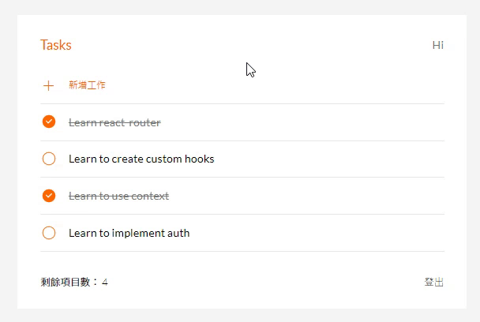

# Todo List - React
AC 前端 React 練習。


# ⚙️Features 功能
使用者可以新增、編輯、刪除 todo

# 🚀 Getting start 開始使用
1. 請先確認有安裝 Node.js 與 npm

2. 將專案 clone 到本地，在終端機輸入：

```
  $ git clone 
```
3. 在本地開啟之後，透過終端機進入資料夾，輸入：
```
  $ npm install
```
4. 安裝完畢後，繼續輸入：
```
  $ npm start
```
5. 若在最末行看見此訊息則代表順利運行，且瀏覽器會自動進入到該網址：http://localhost:3000
```
  webpack compiled successfully
```
6. 若欲暫停使用，請按下：`ctrl + c`
